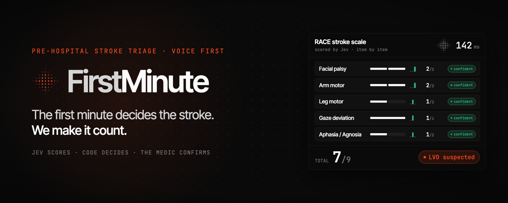
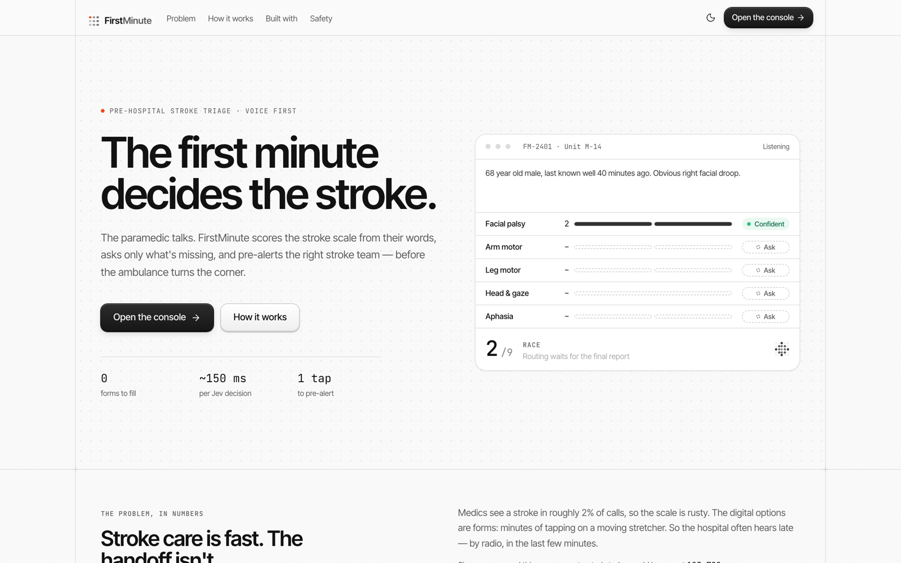
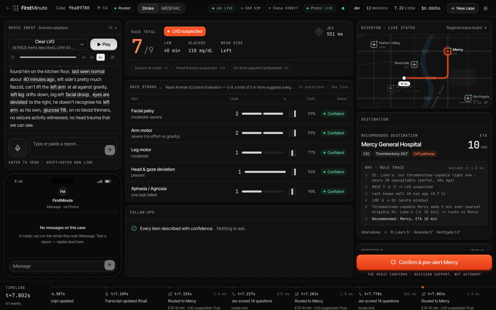
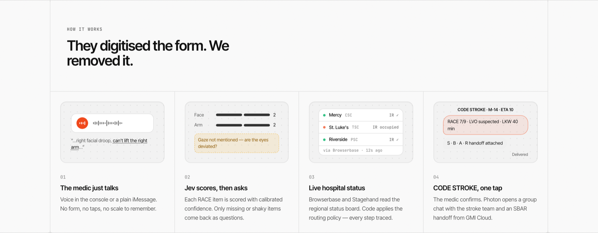

<div align="center">



# FirstMinute

**Voice-first stroke triage for paramedics. The medic describes the patient, the stroke scale is scored in milliseconds, and the right stroke team is alerted before the ambulance arrives.**

[](https://docs.typesafe.ai)
[](https://photon.codes)
[](https://react.dev)
[](https://www.typescriptlang.org)
[](https://fastapi.tiangolo.com)
[](https://render.com)

**[🔴 Live Demo](https://firstminute.onrender.com)** · **[Console](https://firstminute.onrender.com/console)**

🏆 **Top 5 · The AI Collective Hackathon, San Francisco (2026)**

</div>

---

FirstMinute is a decision-support layer for pre-hospital stroke care. A paramedic describes the patient in plain speech (in the console or over iMessage). **Jev**, TypeSafe AI's System 1 decision model, scores every item of the RACE stroke scale with a calibrated confidence. Anything missing or uncertain comes back as a single follow-up question. Deterministic routing then picks the hospital that can actually treat the patient, using live hospital status. After the medic confirms, the stroke team receives a **CODE STROKE** alert with a structured handoff and the destination's address.

> Existing tools put the paper stroke form on a phone. FirstMinute removes the form.

---

## Why

- **Every minute counts.** An untreated stroke destroys about 1.9 million neurons per minute.
- **The handoff is slow.** Guided triage apps take around two minutes of tapping on a moving stretcher, and radio contact often comes only in the last few minutes of transport.
- **Hospitals hear late.** Roughly 1 in 3 EMS stroke patients arrive without a pre-notification.
- **Routing matters.** Going directly to a thrombectomy-capable centre has meant clot removal about two hours sooner than transferring between hospitals.

Stroke scales are already typed forms: each item has a fixed set of levels. Jev returns exactly that shape (a typed answer plus a confidence) in a fraction of a second, which makes it a natural fit.

---

## How It Works

```
paramedic speaks / texts
        │
        ▼
 ┌──────────────┐   14 typed questions, one call (~250 ms)
 │     Jev      │── RACE items · "was it mentioned?" · red flags
 └──────┬───────┘
        │ confident ─────────────► accept
        │ uncertain / missing ───► ask ONE follow-up question
        ▼
 ┌──────────────┐   live status board (diversion · CT · angio suite)
 │  Routing     │── deterministic policy, every step traced
 │  (code)      │
 └──────┬───────┘
        ▼
  medic confirms ──► CODE STROKE alert to the stroke team
                     (SBAR handoff + address, via Photon iMessage)
```

**Jev scores. Code decides. The medic confirms.** Date math, glucose thresholds and routing rules live in deterministic code; the model is only asked the questions it is good at.

---

## Features

- 🗣️ **Voice-first input**: speak into the console (Web Speech API) or text a report over iMessage
- ⚡ **Parallel scoring**: all RACE items, "was it mentioned?" checks and red flags in a single Jev request
- ❓ **Confidence-driven follow-ups**: only missing or uncertain items become questions
- 🩸 **Stroke-mimic flags**: e.g. hypoglycaemia is flagged in code before routing
- 🏥 **Live-status routing**: hospitals on diversion, without CT or with an occupied angio suite are excluded automatically, with a human-readable rule trace
- 📲 **CODE STROKE alerts**: an SBAR handoff and destination address delivered over iMessage via Photon
- 🧩 **Protocol packs**: the same engine runs the stroke scale and a battlefield **9-Line MEDEVAC** request
- 🧪 **Live and simulated modes**: every integration switches on with its API key and falls back to a clearly labelled simulation without one

---

## Screenshots

<table>
  <tr>
    <td width="50%"></td>
    <td width="50%"></td>
  </tr>
  <tr>
    <td align="center"><sub>Landing page</sub></td>
    <td align="center"><sub>Live console: RACE 7/9, routed to a thrombectomy centre</sub></td>
  </tr>
</table>



---

## Tech Stack

| Layer | Technology |
|---|---|
| Decision model | **Jev** (TypeSafe AI System One): choice, score and yes/no questions with calibrated confidence |
| Messaging | **Photon** Spectrum: iMessage in and out, CODE STROKE alerts |
| Frontend | React 19, Vite, TypeScript, Tailwind CSS v4, shadcn/ui, TanStack Query, Motion |
| Backend | FastAPI, Pydantic, httpx, Server-Sent Events |
| Messaging bridge | Node 22, TypeScript, Hono, spectrum-ts |
| Optional integrations | Browserbase + Stagehand (status-board scraping), GMI Cloud (LLM handoff and transcription) |
| Pitch video | Remotion (React), with an original score composed in code |
| Hosting | Render (static site + two web services) |

---

## Project Structure

```
├── backend/     FastAPI: Jev scoring, routing policy, status board, Photon flow, SSE
├── frontend/    React console + landing page (atomic design)
├── messaging/   Photon Spectrum bridge (iMessage)
├── video/       Remotion pitch film, banner and social cards
└── docs/        Spec and README assets
```

---

## Quickstart

Requires **Node 22** and **Python 3.10+**.

```bash
git clone https://github.com/Vignesh-1822/FirstMinute.git
cd FirstMinute

# Backend (http://localhost:8000)
cd backend
python3 -m venv venv && ./venv/bin/pip install -r requirements.txt
cp .env.example .env          # add TYPESAFE_API_KEY for live Jev
./venv/bin/uvicorn main:app --port 8000

# Photon bridge (http://localhost:8787), optional, for iMessage
cd ../messaging
npm install && cp .env.example .env   # SPECTRUM_PROJECT_ID / SPECTRUM_PROJECT_SECRET
npm run build && npm start

# Frontend (http://localhost:5173)
cd ../frontend
npm install && npm run dev
```

Open `http://localhost:5173/console`, pick a scenario and press **Play**. The regional hospital status board is served at `http://localhost:8000/portal`.

### Environment variables

| Variable | Service | Purpose |
|---|---|---|
| `TYPESAFE_API_KEY` | backend | Live Jev scoring (simulated without it) |
| `PHOTON_BRIDGE_URL` | backend | URL of the messaging bridge |
| `STROKE_TEAM_HANDLES` | backend | Comma-separated numbers that receive CODE STROKE alerts |
| `GMI_API_KEY`, `GMI_MODEL` | backend | Optional LLM-written SBAR handoff |
| `BROWSERBASE_API_KEY`, `PORTAL_PUBLIC_URL` | backend | Optional browser-agent status scraping |
| `SPECTRUM_PROJECT_ID`, `SPECTRUM_PROJECT_SECRET` | messaging | Photon project credentials |
| `VITE_API_URL` | frontend | Backend URL (defaults to `http://localhost:8000`) |

---

## Safety

FirstMinute is a **hackathon prototype** built on **synthetic data**. It is decision support, not a medical device. The model never makes the final call: routing is deterministic code, uncertain answers become questions, and every alert requires the paramedic's confirmation. The hospitals and city ("Riverton") are fictional.

---

## Team

Built by **Vignesh Gopal Rajendran**, **Ryan George**, **Anudeep Gumpula** and **Sayli Bhavsar** at The AI Collective hackathon in San Francisco.

Thanks to **TypeSafe AI** for early access to Jev, **The AI Collective** for hosting, and the sponsors: **Photon**, **ElevenLabs**, **Browserbase**, **CodeRabbit** and **GMI Cloud**.
